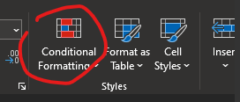

# TRACT TRail Activity Classification Tool

With TRACT you can assign attributes to images from a trail camera or similar
site monitoring image source. TRACT reads EXIF data from the images for time
tagging and allows groups of related images (same subjects, subject coming and
going, etc.) to be defined to analyze activity durations. 


 - [Overview](#overview)
 - [Known issues](#known-issues)
 - [Columns in the spreadsheet](#columns-in-the-spreadsheet)
 - [Developer notes](#developer-notes)

## Overview

The primary function on TRACT is to allow recording of relationships between
images collected over time at a site.  TRACT extracts
[EXIF](https://en.wikipedia.org/wiki/Exif) data from images to get the time and
date of image capture, and provides an interface that allows the user to relate
multiple images together in a group.  TRACT also allows entry of descriptors
for images - composition of groups present, activity, etc., see the
[spreadsheet columns](#columns-in-the-spreadsheet) section for more details.

TRACT is intended to be a functional minimal viable product (MVP), solving
the specific problem of relating images into groups and allowing associated
data entry.  Part of its minimalistic design is the use of a single Excel
spreadsheet (.xlsx) as a data-store.  The use of the Tkinter interface, a
simple GUI library bundled with Python, also emphasizes a light weight low
dependency approach. Similarly, although unrelated to the code is this
repository, [Auto PY to EXE](https://github.com/brentvollebregt/auto-py-to-exe)
is used to package TRACT into a zero install executable.  This results in a
large executable that is somewhat slow to launch, but avoids spending time on
setting up a build environment for a more customized software stack.

## Known issues

- Distributed .exe loads v. slowly.
- New file can only be created as the first action, not
  after an existing file has been loaded.
- Data file name *must* end in .xlsx, but not enforced.
- You must load at least one image into the data file
  before the rest of the UI is accessible.
- No way to un-add incorrectly added group other
  than editing .xlsx file directly.
- Having to resize the feedback panel every time.
- Distributed .exe is large.

## Columns in the spreadsheet

Note: you can customize columns by saving this file:
https://raw.githubusercontent.com/USEPA/TRACT/main/tract/tract_fields.yml
*in the same folder as the tract.exe file* and editing appropriately.
The file must be named `tract_fields.yml`.

In the order they occur from left to right:

**image_time**: The time the image was captured according to the trail camera.
YYYY/MM/DD HH:MM:SS.  Not unique when there's more than one group seen in a single image
or two different trail cameras coincidentally capture images in the same second.

**group_number**: Very rarely two groups of resource users may be seen in the same
image.  In these cases there will be multiple records (rows) in the spreadsheet
referring to the same image (added using the Add group button).  The typical case is
that there is a single record for each image, and the `group_number` is 1.  This is true
even for images with no relevant content, e.g. triggered by animals or wind.  When the
data entry person adds a second record for the same image with the `Add group` button,
that record will have `group_number` = 2, and so on if there are additional groups.

**adults_n**: Number of adults seen in the image (in the group the record describes,
typically only one group per image).

**children_n**: Number of children seen in the image / group.

**pets_n**: Number of pets seen in the image / group.

**direction**: Direction of travel.

**activity**: Activity in which the group is engaged.

**other**: When `activity` = "other", describe here.

**camera_deploy**: Text identifying the camera and the deployment period, e.g.
"main-gate-2022-spring" as the camera's precise position may vary between deployments.

**temperature_f**:  The temperature in degrees Fahrenheit as shown on the image.  This
information is not available in the image's metadata (exif-data) and must be entered
manually.

**group_id**: Not to be confused with `group_number`, this unique value identifies the
group being described by the record, and will be shared between all records in which the
same group is seen.  This is the field controlled by the "Related observations" `Add`
and `Unrelate` buttons.

**entry_by**: The name / initials of the person doing initial data entry.  Each person
should always use exactly the same name / initials, the drop down menu provides values
previously used.

**qa_by**: The name / initials of the person doing quality assurance (QA).  Each person
should always use exactly the same name / initials, the drop down menu provides values
previously used.

**observation_status**: The (workflow) status of the observation.  This starts off as
blank or "not classified" when a record is first created for an image, and can be
advanced through various states such as "entry complete" and "QA complete".

**image_name**: The filename of the image without path, usually something like
`YYYYMMDD_HHMMSS.jpg`.

**image_path**: The path and name of the image within the project's top level image
folder, something like `site3/north_camera/2021/20210804_114454.jpg`.

**image_path_full**: The full path to the image the last time the data was saved.  This
will include the location of the project's not level image folder, which can be changed
as needed.  Something like
`c:\User\Jo\projects\monitoring\images\site3\north_camera\2021\20210804_114454.jpg`.

**image_w**: The width of the image in pixels as read when the observation is created.

**image_h**: The height of the image in pixels as read when the observation is created.

**image_bytes**: The size of the image in bytes as read when the observation is
created.

**observation_id**: A unique ID for this observation (row).

**image_hash**: A unique fingerprint for the image.  If the `image_path` field was lost
or the images were re-arranged in the folder so they no longer match the `image_path`
field, this fingerprint could be used to re-link the images and the observation records,
*as long as the images have not been altered in any way* (annotated, resized, etc.).

## Copy Paste controls

There are four copy / paste buttons below the image:

`Copy` - this copies the current observation's data to the clipboard.

`Paste` - this pastes the data previously copied to the clipboard with the
`Copy` button into the current observation.

`Paste+` - like `Paste`, but also advances to next observation.

`Paste Prev.` - like paste, but copies data from the immediately previous
observation, not the clipboard.

## Comparing sheets in Excel

### Basic procedure

- Load both workbooks.
- Copy all of one.
- In the other, rename its one sheet (tabs at the bottom) something like "JJJ"
- Add a sheet, name it something like "AS", and paste the copied content in the new sheet.
- Close the unaltered workbook.
- Add a third sheet, and put this formula in cell A1

```Excel
=IF(JJJ!A1=AS!A1, JJJ!A1, JJJ!A1 & " : " & AS!A1 & ": ?")
```

which reads "if content in sheet JJJ cell A1 equals content in sheet AS cell A1
show content from sheet JJJ cell A1 otherwise show 'X : Y: ?' where X and Y are
the respective content from JJJ and AS".

Then to make the non-matching entries pink, select the entire sheet, then from
the Home menu in the Styles "group" select the Conditional Formatting icon:



- Highlight Cells Rules
- Text that Contains...
- Then add a rule for text that contains ": ?" (colon space question-mark
  without the quotes) and pick a format, you can choose Custom format to make
  the pink background or just use one of the presets.

Now everything that doesn't match should be highlighted.

### Image classification sheet comparison specifics

`group_id`, `observation_id`, `image_full_path`, `entry_by`, `qa_by` - these are not
expected to match and their columns can be hidden.

`image_name` is intended to match and `image_path` will match if you arranged
image folders the same way.

`image_name` might not match if filenames weren't converted to
`YYYYMMDD_HHMMSS` format.  So this is a case where that weird `image_hash`
column is valuable, as long as that matches you know you're looking at the same
image regardless of filename etc.

The final step in preparing the comparison spread-sheet is adjusting for
additional groups, and missing days.  The mechanics are just to move the data
in the sheet without the group / missing day down, creating a blank line
/ lines.  But Excel "helps" by adjusting the formulas in the comparison sheet
to account for the shift.  To avoid this select the entire range that needs to
move down, and move it down with the mouse while holding Ctrl.  This fills in
the space with copies of the top row of the moved range, those need to be
selected and cleared (Delete).

## Developer notes

```shell
python -m venv venv_tract
. venv_tract/bin/activate
pip install -r requirements.txt
# see pre-commit
mkdir -p .git/hooks; cp pre-commit .git/hooks; chmod +x .git/hooks/pre-commit
```

```shell
conda create -n pyexe --override-channels -c conda-forge 'python>=3.9'
pip install auto-py-to-exe
start /c/Users/UserName/pkg/miniconda/envs/pyexe/Scripts/auto-py-to-exe.exe
```

## EPA Disclaimer

The United States Environmental Protection Agency (EPA) GitHub project code
is provided on an "as is" basis and the user assumes responsibility for its
use. EPA has relinquished control of the information and no longer has
responsibility to protect the integrity , confidentiality, or availability
of the information. Any reference to specific commercial products, processes,
or services by service mark, trademark, manufacturer, or otherwise, does not
constitute or imply their endorsement, recommendation or favoring by EPA. The
EPA seal and logo shall not be used in any manner to imply endorsement of any
commercial product or activity by EPA or the United States Government.
